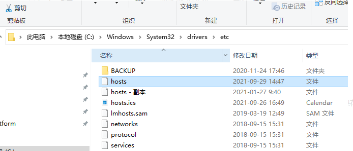
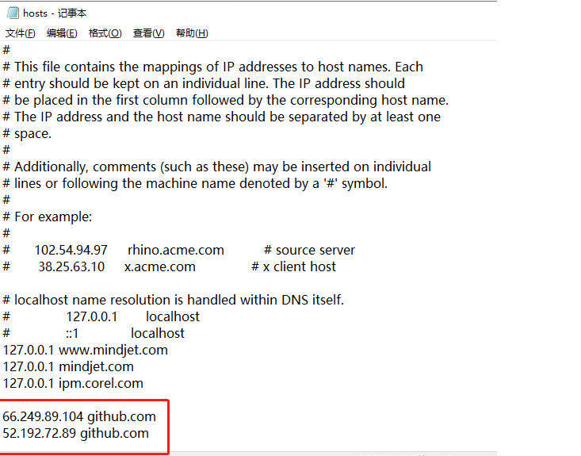
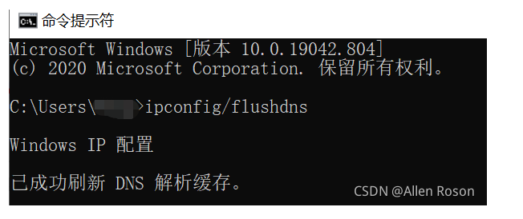

# 解决github网站打不开和跳转失败的问题

 相信很多人都遇到过点击github官网的连接，但是进不去的问题，也遇到过进去github之后，点着点着就提示网页打不开了，下面是解决办法，亲自试过，感觉效果比较明显。

# 第1步

百度搜索’查询网址dns,或者’可以直接输入网址https://tool.chinaz.com/dns/

下面这个图是我打开https://tool.chinaz.com/dns/之后看到的样子，在这个界面输入github.com，然后点击检测按钮，下面会出来两个IP，把这两个IP记下来。

# 第2步

添加IP到hosts文件中，这个文件在不同操作系统中其路径不一样：

windows：C:\Windows\System32\drivers\etc\hosts
Mac：在Finder中同时按“Shift”“Command”“G”三个键，输入“/etc/hosts”
linux：/etc/hosts
注意，不同系统上，hosts文件的路径可能有细微差别，大家找的时候注意一下下面这个图是我电脑上的路径：

然后用文本编辑器（记事本，Notepad++，UEStudio等）打开这个文件， 把第1步中找到的IP添加到文件末尾，然后保存关闭即可。

# 第3步

打开CMD命令提示符界面，输入“**ipconfig/flushdns**”，然后回车，这个命令会刷新DNS。然后重启浏览器之后就能成功进入Github 了。

